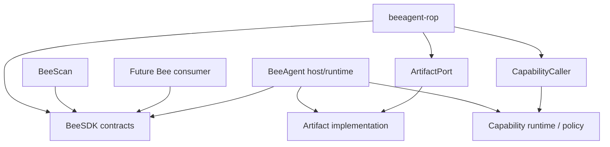

# ARCHITECTURE — BeeSDK (KISS, contracts-only, reusable)

## Идея

`beesdk` — отдельный минимальный Python SDK с общими публичными contracts для Bee ecosystem.

Он нужен, чтобы Bee-проекты не копировали друг у друга базовые platform contracts и не зависели от внутренних файлов конкретного runtime.

Целевая модель:

```text
beesdk
  ↑
  ├── beeagent
  ├── beeagent-rop
  ├── beescan
  └── future Bee consumers
```

Главное правило:

> Consumers depend on BeeSDK. BeeSDK never depends on consumers.

BeeSDK не является:

- runtime;
- orchestrator;
- BeeAgent module;
- UI framework;
- storage layer;
- connector layer;
- capability executor;
- plugin framework.

## Основной принцип

Правильная схема:

```text
consumer/domain code
        ↓
      BeeSDK
   contracts only
        ↑
        │ implemented/bound by host
        │
   BeeAgent runtime
```

Для module execution:

```text
BeeAgent runtime
    ↓
BeeSDK ModuleContext / ModuleContract
    ↓
domain module
    ↓
bounded host-owned ports
```

BeeSDK описывает форму взаимодействия, но не выполняет само взаимодействие.

## Что живёт в BeeSDK

В `beesdk` должны жить только небольшие reusable public contracts, которые доказали свою необходимость как минимум реальным consumer use case.

Текущий v0.1 scope:

- `AuthorityLevel`;
- `ModuleContext`;
- `ModuleResult`;
- `ModuleContract`;
- `ArtifactPort`;
- `CapabilityCaller`;
- `CapabilityResult`;
- `CapabilityStatus`;
- stable public contract modules;
- type information через `py.typed`.

В будущем новый contract добавляется только когда есть реальный consumer evidence.

## Что НЕ живёт в BeeSDK

В BeeSDK не должны жить:

- orchestration;
- run/session lifecycle implementation;
- job state;
- storage implementation;
- filesystem artifact implementation;
- config loader;
- `.env` handling;
- logging framework;
- FastAPI;
- CLI runtime;
- subprocess execution;
- HTTP/network clients;
- MCP transport;
- n8n execution;
- LLM/provider integrations;
- capability runtime;
- `ScopedCapabilityGateway`;
- approval engine;
- UI;
- BeeUI components;
- Bitrix/1C/email integrations;
- ROP-specific contracts;
- BeeScan-specific contracts;
- client-specific business rules;
- dependency injection framework;
- dynamic plugin marketplace/registry.

Правило:

> Если code выполняет работу, ходит во внешнюю систему, хранит runtime state или знает бизнес-семантику конкретного продукта — почти наверняка это не BeeSDK.

## Ownership

### BeeSDK owns

BeeSDK владеет:

- public type/contracts;
- structural protocols;
- stable public import surface;
- compatibility expectations;
- contract-level security boundaries;
- package metadata;
- package version.

### BeeAgent owns

BeeAgent как host/runtime владеет:

- orchestration;
- module loading/dispatch;
- run/session context;
- actual authority assignment;
- policy enforcement;
- capability routing/execution;
- artifact lifecycle;
- runtime config;
- approvals;
- external connectors;
- state;
- execution/egress.

### Domain modules own

Domain modules (`beeagent-rop`, `beescan`, future modules) владеют:

- domain models;
- taxonomy;
- classification;
- rules;
- domain validation;
- fixtures;
- domain summaries;
- domain recommendations;
- domain AI semantics.

### BeeUI owns

BeeUI владеет:

- generic UI rendering;
- reusable presentation contracts;
- generic components;
- generic UI integration behavior.

BeeUI не должен зависеть от BeeSDK только потому, что оба проекта относятся к Bee ecosystem.

Dependency появляется только при доказанной общей contract need.

## Public package structure

Текущая структура должна оставаться простой:

```text
src/
└── beesdk/
    ├── __init__.py
    ├── modules.py
    ├── artifacts.py
    ├── capabilities.py
    └── py.typed
```

Не нужно заранее строить:

```text
contracts/
runtime/
state/
config/
execution/
plugins/
providers/
adapters/
```

Новые package layers создаются только когда текущая плоская структура перестаёт быть понятной.

## Stable public contract-module import surface

Публичные consumer contracts должны импортироваться через explicit public contract modules:

```python
from beesdk.artifacts import ArtifactPort
from beesdk.capabilities import CapabilityCaller, CapabilityResult, CapabilityStatus
from beesdk.modules import AuthorityLevel, ModuleContext, ModuleContract, ModuleResult
```

Consumer не должен зависеть от private internal paths:

```python
from beesdk.internal.foo.bar import ...
```

Правило:

> `src/beesdk/__init__.py` intentionally remains empty; `beesdk.artifacts`, `beesdk.capabilities` and `beesdk.modules` are stable public import boundaries.

Public contract modules must remain compatible.

## Module contract

Минимальный module contract:

```text
module_id
authority
supported_case_types()
handle(context)
```

`ModuleContext` передаётся host/runtime.

Он содержит host-owned invocation context, включая:

- `run_id`;
- `case_type`;
- `module_id`;
- payload;
- `session_id`;
- authority;
- optional artifact port.

`artifact_api` сохраняет существующее имя для migration compatibility с BeeAgent ecosystem.

BeeSDK не создаёт этот object как runtime lifecycle owner — он только определяет его contract.

## Authority model

Базовые значения:

```text
read_only
draft_only
execution_capable
```

Authority назначается host/runtime.

Module не должен самостоятельно повышать свои права.

`ModuleResult.authority` и `CapabilityResult.authority` описывают authority, применённую host/runtime, но сами по себе не предоставляют execution rights.

## Artifact boundary

`ArtifactPort` — structural protocol.

BeeSDK задаёт только минимальную capability, необходимую module consumer:

```text
write_json(...)
```

BeeSDK не определяет:

- filesystem path;
- run directory;
- retention;
- file permissions;
- artifact allowlist;
- serialization implementation;
- read/list lifecycle.

Это ответственность host.

Целевая схема:

```text
domain module
    ↓
ArtifactPort
    ↓
host implementation
    ↓
host-owned storage
```

## Capability boundary

`CapabilityCaller` — module-facing contract.

Module может передать:

```text
capability_name
payload
```

Module не должен передавать через public caller:

```text
authority
module_id
run_id
session_id
case_type
```

Эти значения принадлежат host/runtime.

Целевая схема:

```text
module
  │
  │ capability_name + payload
  ▼
host-provided CapabilityCaller
  │
  ├── binds module identity
  ├── binds run/session identity
  ├── binds authority
  ├── applies policy
  └── routes execution
```

BeeSDK v0.1 определяет `CapabilityCaller` contract, но не определяет конкретный runtime injection mechanism.

`ScopedCapabilityGateway` и другой execution/runtime code не входят в BeeSDK v0.1.

## Dependency direction

Runtime dependency rule для v0.1:

```text
beesdk -> Python stdlib only
```

Запрещённые dependency directions:

```text
beesdk -> beeagent
beesdk -> beeagent-rop
beesdk -> beescan
beesdk -> beeui
```

Разрешённое направление:

```text
beeagent -> beesdk
beeagent-rop -> beesdk
beescan -> beesdk
```

Если новый contract требует импортировать consumer package внутрь BeeSDK — boundary выбрана неправильно.

## Consumer integration

BeeSDK подключается как обычная Python dependency.

Во время локальной разработки consumer может использовать sibling repository через `uv`:

```toml
[tool.uv.sources]
beesdk = { path = "../beesdk", editable = true }
```

После появления release consumer должен зависеть от известной совместимой версии BeeSDK.

BeeSDK не должен жить как:

```text
beeagent/src/beesdk/
```

или:

```text
beeagent/modules/beesdk/
```

Он является отдельным repository/package.

## Versioning and compatibility

BeeSDK использует SemVer.

Версия принадлежит самому SDK и не связана с версиями:

- BeeAgent;
- ROP;
- BeeUI;
- BeeScan.

Пример:

```text
beeagent      0.53.x
beeagent-rop  0.19.x
beeui         0.26.x
beesdk        0.1.x
```

`pyproject.toml` — source of truth package version.

Обычные feature/fix PR не должны вручную повышать version.

Release version, changelog и tag управляются release process / release-please.

Compatibility principles:

- не ломать существующий public API без необходимости;
- новые optional contracts предпочтительнее breaking replacement;
- не переименовывать public fields ради косметики;
- не расширять SDK speculative contracts “на будущее”;
- breaking change должен быть явным и documented;
- consumer migration должна быть проверяема.

## KISS evolution rule

Новый SDK contract оправдан, когда выполняется хотя бы одно:

1. contract уже существует в host и копируется consumers;
2. два или более consumers используют одну semantic boundary;
3. новый consumer невозможно правильно подключить без shared contract;
4. отсутствие contract создаёт реальный architecture/security drift.

Недостаточные причины:

- “может пригодиться”;
- “так делают большие SDK”;
- “на будущее будет красиво”;
- “давайте сразу построим plugin framework”.

## Current architecture flow

Для module integration:

```text
BeeAgent runtime
      ↓
host-owned context
      ↓
BeeSDK ModuleContext
      ↓
domain module
      ↓
ModuleResult
      ↓
BeeAgent runtime
```

Для artifacts:

```text
domain module
      ↓
ArtifactPort
      ↓
BeeAgent ArtifactAPI implementation
      ↓
BeeAgent-owned artifact lifecycle
```

Для capabilities:

```text
domain module
      ↓
CapabilityCaller
      ↓
BeeAgent host policy/runtime
      ↓
capability implementation
      ↓
external system
```

## Repository structure

Recommended current structure:

```text
beesdk/
├── .agents/
├── .github/
├── docs/
│   ├── ROADMAP.md
│   ├── SPEC.md
│   ├── ARCHITECTURE.md
│   ├── SDLC.md
│   ├── SECURITY.md
│   └── DEV_GUIDE.md
├── src/
│   └── beesdk/
│       ├── __init__.py
│       ├── modules.py
│       ├── artifacts.py
│       ├── capabilities.py
│       └── py.typed
├── tests/
├── AGENTS.md
├── CHANGELOG.md
├── README.md
├── README.ru.md
├── pyproject.toml
└── uv.lock
```

Нет необходимости добавлять:

```text
config/
storage/
logs/
start.sh
server.py
```

пока BeeSDK остаётся library package.

## Mermaid-схема



## Summary

BeeSDK должен оставаться скучным.

Это хороший признак.

Его задача:

```text
small contracts
+ stable imports
+ explicit authority boundaries
+ compatibility
```

а не создание второго BeeAgent core.
